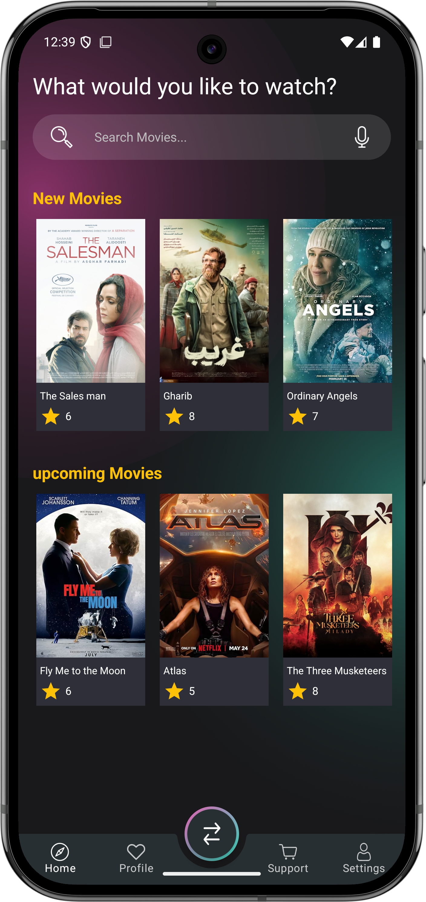
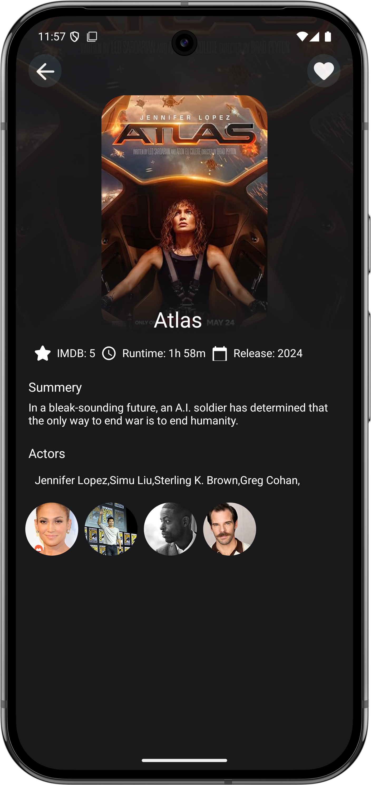
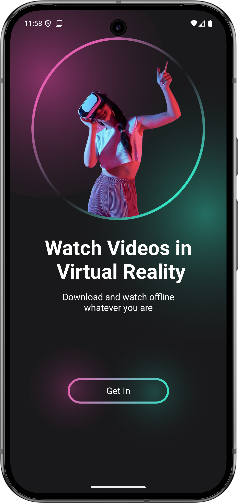
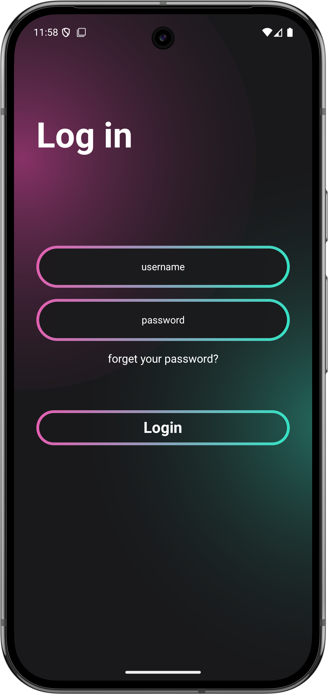

🎬 Movie App

A simple Movie App built using Jetpack Compose and Material Design for Android. Focusing on UI development with Compose, navigation, and state management. Note that this is purely a Jetpack Compose app with no backend functionality for streaming or playing films.

🛠 Tech Stack

Kotlin – Primary programming language

Jetpack Compose – UI toolkit for building native UI

Material Design – Modern UI design principles

📸 Screenshots

